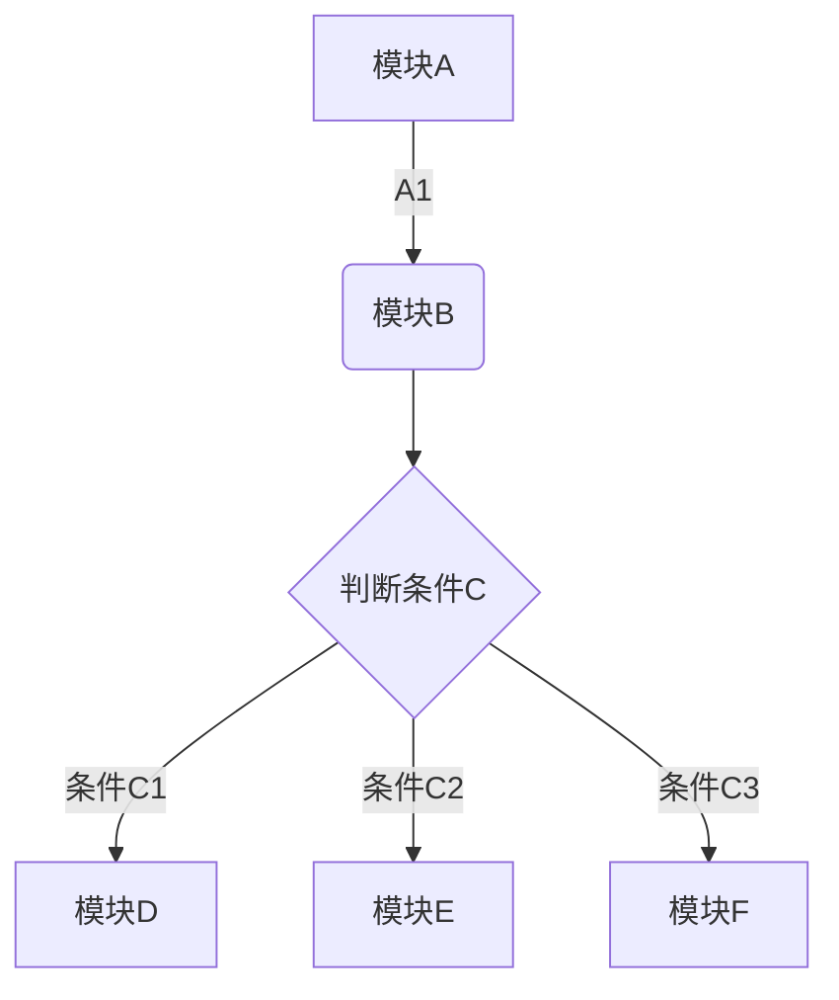
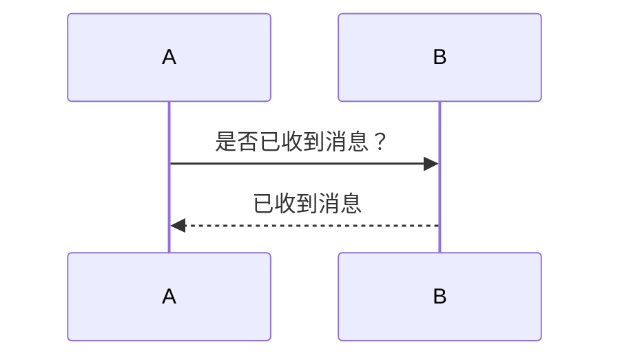
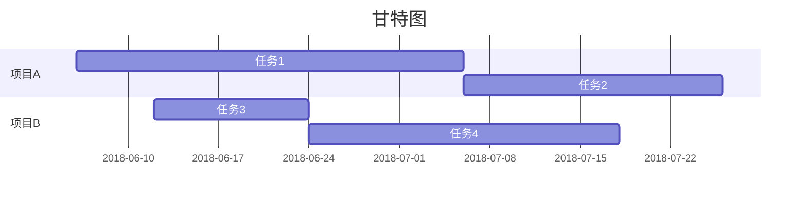

title: Markdown语法
url: 918.html
id: 918
categories:
  - 技术博文
date: 2019-02-21 15:46:41
tags:
---
在了解 Markdown 语法之前，博主十分强烈的推荐大家一款简洁易用的 Markdown 编辑器——Typora，按照官方的说法就是**简单而强大**，它不仅支持原生的 Markdown 语法，也支持对应的快捷键，更重要的是它还可以实时预览 ，简直不要太优秀了。这里附上Typora的下载地址：[https://www.typora.io/](https://www.typora.io/)，有兴趣的小伙伴可以下载来试试哦

好，下面开始进入正题，介绍一些常用的 Markdown 语法

#### （1）标题

**Markdown 语法**  

    # 一级标题
    ## 二级标题
    ### 三级标题
    #### 四级标题
    ##### 五级标题
    ###### 六级标题

**Typora 快捷键：**

Ctrl+1：一级标题

Ctrl+2：二级标题

Ctrl+3：三级标题

Ctrl+4：四级标题

Ctrl+5：五级标题

Ctrl+6 ：六级标题

Ctrl+0：段落

#### （2）粗体、斜体、删除线和下划线

**Markdown 语法：**

    *斜体*
    **粗体**
    ***加粗斜体***
    ~~删除线~~

**Typora 快捷键：**

Ctrl+I：斜体  
Ctrl+B：粗体  
Ctrl+U：下划线  
Alt+Shift+5：删除线

#### （3）引用块

**Markdown 语法：**

    > 文字引用

**Typora 快捷键：** Ctrl+Shift+Q

#### （4）代码块

**Markdown 语法：**

    `行内代码`
    
    ```
    多行代码
    多行代码
    ```

**Typora 快捷键：**

行内代码： Ctrl+Shift+`
多行代码：Ctrl+Shift+K

`
#### （5）公式块

**Markdown 语法：**

    $$
    数学公式
    $$

**Typora 快捷键：** Ctrl+Shift+M

#### （6）分割线

**Markdown 语法：**

    方法一：---
    
    方法二：+++
    
    方法三：***

#### （7）列表

**Markdown 语法：**

    1. 有序列表项
    
    * 无序列表项
    
    + 无序列表项

**Typora 快捷键：**

有序列表项：Ctrl+Shift+\[  
无序列表项：Ctrl+Shift+\]

#### （8）表格

**Markdown 语法：**

    表头1|表头2
    -|-|-
    内容11|内容12
    内容21|内容22

**Typora 快捷键：** Ctrl+T （这里就充分体现使用 Typora 快捷键的便捷性了）

#### （9）超链接

**Markdown语法：**

    方法一：[链接文字](链接地址 "链接描述")
    例如：[我的博客](https://forwhfang.github.io/ "我的博客")
    
    方法二：<链接地址>
    例如：<https://forwhfang.github.io>

**Typora快捷键：** Ctrl+K

#### （10）图片

**Markdown语法：**

    ![图片文字] (图片地址 "图片描述")
    例如：![示例图片] (https://www.example.com/example.PNG "示例图片")

**Typora快捷键：** Ctrl+Shift+I


### 特殊格式
#### 水平线

* * *

#### 任务

* [x] 任务


#### 图表
##### 饼图
```chart
,Budget,Income,Expenses,Debt
June,5000,8000,4000,6000
July,3000,1000,4000,3000
Aug,5000,7000,6000,3000
Sep,7000,2000,3000,1000
Oct,6000,5000,4000,2000
Nov,4000,3000,5000,

type: pie
title: Monthly Revenue
x.title: Amount
y.title: Month
y.suffix: $
```

##### 折线图
```chart
,Budget,Income,Expenses,Debt
June,5000,8000,4000,6000
July,3000,1000,4000,3000
Aug,5000,7000,6000,3000
Sep,7000,2000,3000,1000
Oct,6000,5000,4000,2000
Nov,4000,3000,5000,

type: line
title: Monthly Revenue
x.title: Amount
y.title: Month
y.suffix: $
```

##### 柱状图
```chart
,Budget,Income,Expenses,Debt
June,5000,8000,4000,6000
July,3000,1000,4000,3000
Aug,5000,7000,6000,3000
Sep,7000,2000,3000,1000
Oct,6000,5000,4000,2000
Nov,4000,3000,5000,

type: column
title: Monthly Revenue
x.title: Amount
y.title: Month
y.suffix: $
```
##### 横向柱状图
```chart
,Budget,Income,Expenses,Debt
June,5000,8000,4000,6000
July,3000,1000,4000,3000
Aug,5000,7000,6000,3000
Sep,7000,2000,3000,1000
Oct,6000,5000,4000,2000
Nov,4000,3000,5000,

type: bar
title: Monthly Revenue
x.title: Amount
y.title: Month
y.suffix: $
```

#### 数学公式
```math
e^{i\pi} + 1 = 0
```

#### 流程图

#### 时序图

#### 甘特图



**说明**：在Hexo中插入图片时，请按照以下步骤进行设置

（1）将站点配置文件中的 `post_asset_folde` 选项设置成 true

（2）在站点文件夹中打开 git bash，输入命令 `npm install hexo-asset-image --save` 安装插件

（3）此时使用 `hexo new title` 创建文章时，将同时在 source/_post 文件夹中生成一个与 title 同名的文件夹，我们只需将待添加的图片放进此文件夹中，然后在文章中通过 Markdown 语法进行引用即可

例如，在资源文件夹（就是那个与 title 同名的文件夹）中添加了图片 example.PNG，则可以在对应的文章中使用语句 `` 添加图片

参考文献

*   [Hexo撰写文章](https://blog.csdn.net/wsmrzx/article/details/81478945)